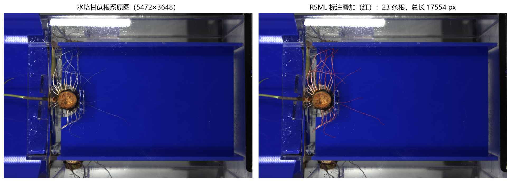
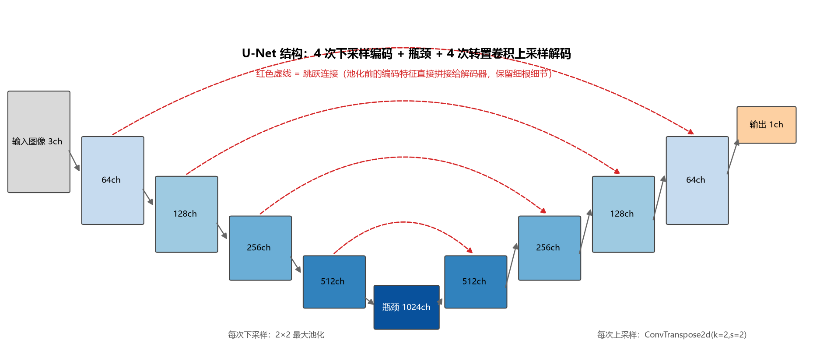
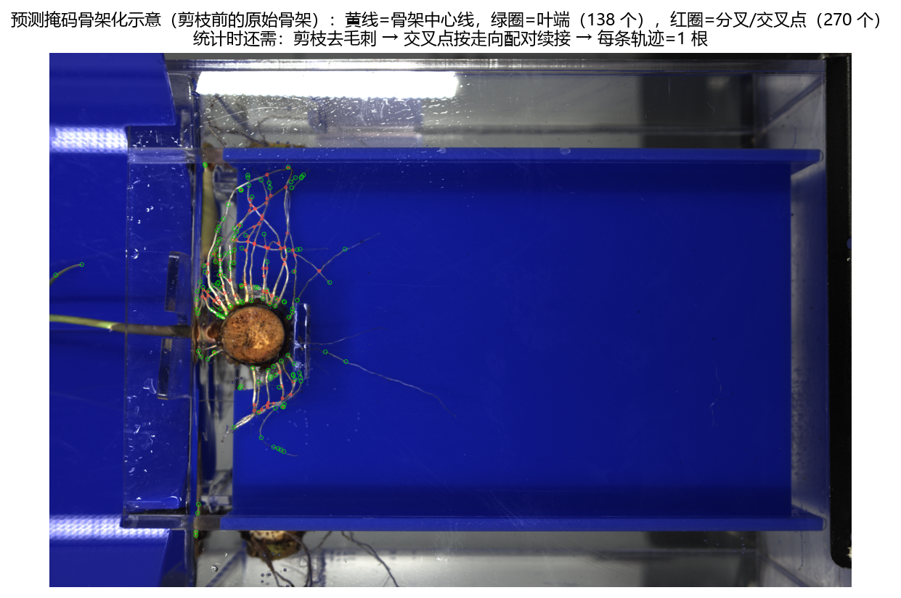
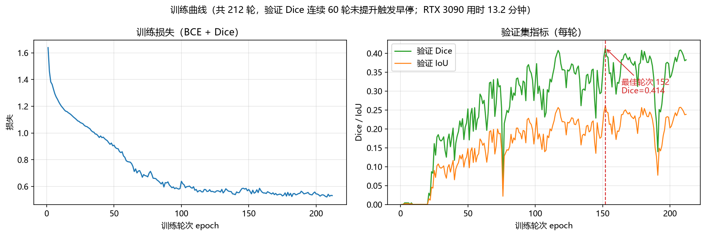
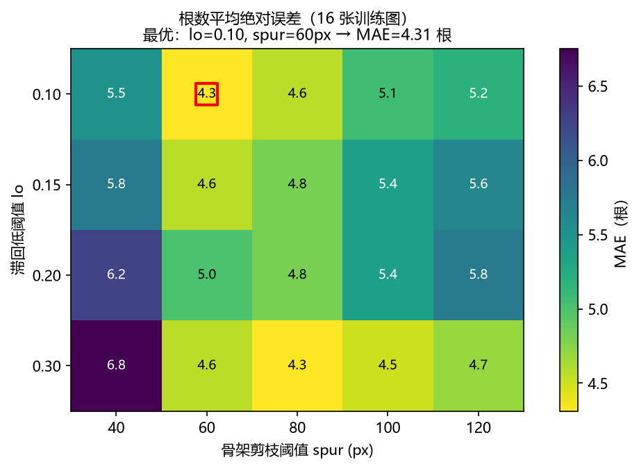
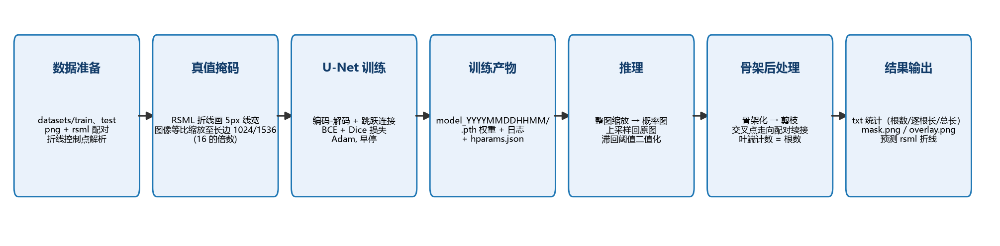
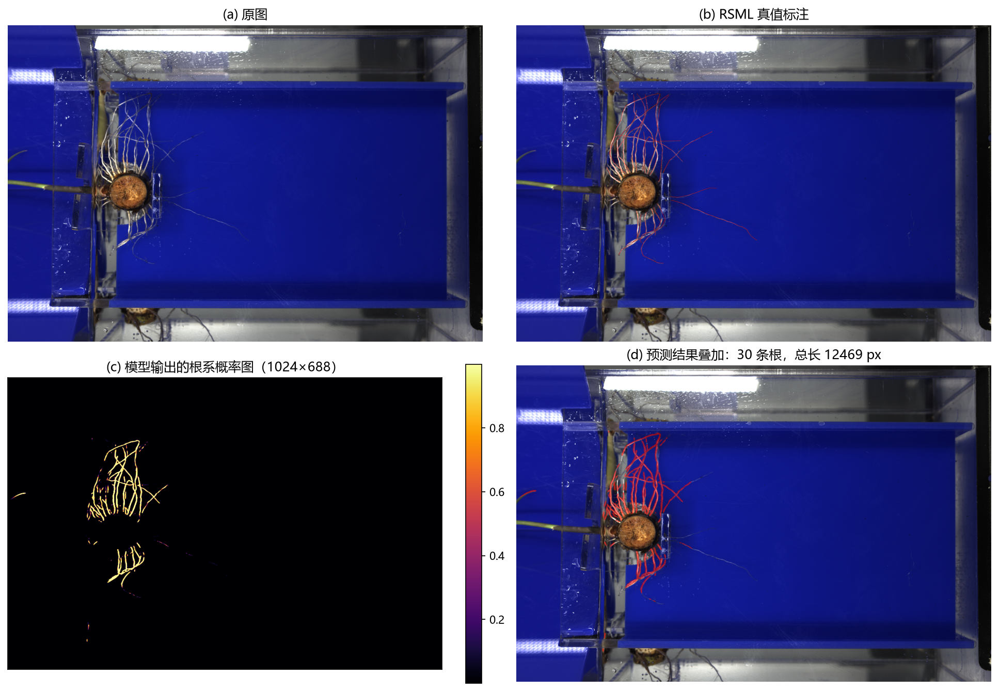
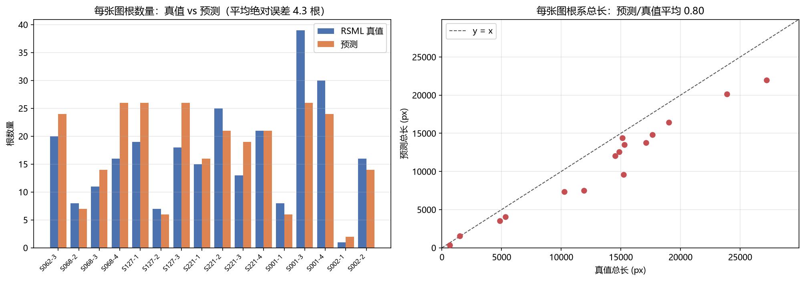

# 基于 U-Net 的甘蔗根系分割与根系统计实验报告

> 项目：Deep_learning_model_for_sugarcane　|　日期：2026-09-11
> 报告内全部插图由 [make_figures.py](make_figures.py) 自动生成（`figures/` 目录）

---

## 一、实验目的

1. 构建 **U-Net 语义分割网络**，从水培甘蔗根系照片中自动识别并分割出根系区域；
2. 基于分割结果自动统计每张图片的**根数量、各根系长度（像素）、总根系长度**，替代人工测量；
3. 实现完整的工程流水线：训练（`train/train.py`）→ 测试评估（`test/test.py`）→ 推理应用（`inference.py`），
   推理结果自动保存统计表格、可视化图片以及与标注同格式的预测 RSML 折线文件。

---

## 二、实验原理

### 2.1 问题定义

输入为水培环境下的甘蔗根系 RGB 照片（5472×3648），输出为逐像素的二值掩码
（1 = 根系，0 = 背景），属于**二分类语义分割**问题。根系呈细长线状结构，
与背景（蓝色水槽、栽培装置）对比明显但细根、交叉处识别困难。

### 2.2 数据与真值标注（RSML）

数据集共 **22 组**（每组 1 张图 + 1 个同名 RSML 标注文件），其中训练 16 组、测试 6 组，
合计 340 条根（均为 `primary` 主根），单图根数 1~39 条不等。

RSML 是根系研究领域的标准 XML 标注格式，用**折线控制点**描述每条根的中心线：

```xml
<plant ID="2" label="barley">
  <root ID="2.1" label="primary">
    <geometry>
      <rootnavspline controlpointseparation="50" tension="0.5">
        <point x="1638" y="786" />   <!-- 该根起点 -->
        <point x="1505" y="819" />
        ...
      </rootnavspline>
    </geometry>
  </root>
</plant>
```

规则：**无几何坐标（没有 `<point>`）的 plant 直接忽略**；一条根的标注长度 = 控制点折线逐段欧氏距离之和。
标注经解析后以 **5 px 线宽**绘制到原图分辨率画布上，即得到训练用真值掩码（图 1）。


*图 1　水培甘蔗根系原图（左）与 RSML 标注叠加（右，红）。*

### 2.3 U-Net 分割网络

采用经典 U-Net 编码-解码结构（图 2）：左侧编码器经 4 次"卷积块 + 2×2 最大池化"逐步下采样
（通道 64→128→256→512），瓶颈层 1024 通道；右侧解码器经 4 次 `ConvTranspose2d` 转置卷积上采样，
每层与编码器**同分辨率的跳跃连接特征**拼接后卷积。跳跃连接（本项目取**池化前**的编码特征）
把高分辨率细节直接传给解码器，对细根这类线状目标尤为重要。网络参数量 **31.04 M**，
输入输出长宽均取 16 的整数倍。


*图 2　U-Net 结构示意：编码器 4 次下采样、瓶颈、解码器 4 次上采样，红色虚线为跳跃连接。*

### 2.4 损失函数

训练损失 = 二元交叉熵 + Dice 损失：

```text
Loss = BCEWithLogits(ŷ, y) + [ 1 - (2·Σŷy + ε) / (Σŷ + Σy + ε) ]
```

BCE 提供逐像素监督，Dice 项直接优化前景重叠率，缓解根系像素占比极小（正负样本严重不均衡）的问题。

### 2.5 推理后处理与根系统计原理

模型直接输出的是概率图，需经后处理才能得到"根的条数与长度"。流程如下（图 3）：

1. **滞回阈值二值化**：高阈值 0.5 确定可靠根段，低阈值 0.10 把细弱处断续的段接回，
   避免一条根被断成多段、统计成多根；
2. **骨架化**：`skimage.morphology.skeletonize` 把掩码细化为单像素宽中心线；
3. **剪枝**：从叶端向内剥除短于 60 px 的末梢，去掉种子基部厚块产生的毛刺；
4. **交叉点续接配对**：在分叉/交叉点把方向最连贯的两条臂配成一对（十字交叉的两条根走向连续，
   配对即把交叉的根"穿过去"还原整根）；
5. **串轨迹与计数**：沿配对关系从叶端串出完整轨迹，**每条轨迹 = 一条根**，
   根数 ≈ 叶端数 / 2（每条根两端在图上分开时严格成立）；
6. **长度口径**：沿骨架按 8 邻域链码累加（直连 1、对角 √2，即像素欧氏距离），与 RSML 折线口径一致。


*图 3　预测掩码骨架化结果：黄线 = 骨架中心线，绿圈 = 叶端，红圈 = 分叉/交叉点。*

### 2.6 评价指标

| 指标 | 公式 | 说明 |
|---|---|---|
| IoU | `TP / (TP + FP + FN)` | 交并比，掩码重合度 |
| Dice | `2TP / (2TP + FP + FN)` | 与 IoU 等价族，对细目标更敏感 |
| 像素准确率 | `(TP + TN) / N` | 整体像素正确率 |
| 根数误差 | `|预测根数 − 真值根数|` | 逐图统计，报告平均值 |
| 总长对比 | `预测总长 / 真值总长` | 像素长度口径 |

---

## 三、实验过程

### 3.1 实验环境

| 项目 | 本地开发机 | 训练服务器 |
|---|---|---|
| GPU | NVIDIA RTX 5060 Laptop 8 GB | NVIDIA RTX 3090 24 GB |
| Python | Anaconda 环境 `pcc`（3.12） | Anaconda 环境 `rootnav`（3.9） |
| 框架 | PyTorch 2.12.1 + CUDA 13.0 | PyTorch 2.7.1 + CUDA 12.6 |
| 依赖 | numpy / pillow / scikit-image | 同左 |

训练命令（服务器）：

```bash
export CUDA_VISIBLE_DEVICES=0        # 指定可用 GPU（集群注入的卡号需核对）
python train/train.py --size 1536 --batch 4 --epochs 5000
```

### 3.2 数据准备

1. 扫描 `datasets/train`、`datasets/test` 下的 png（图片）与同名 rsml（标注）配对；
2. 解析 RSML 折线控制点，忽略无几何的 plant；
3. 在**原图分辨率**上以 5 px 线宽绘制全部根折线，得到真值掩码；
4. 图像与掩码同步等比缩放：训练时按长边 1536 缩放（得 1536×1024，恰为 16 的倍数），
   本地/推理默认长边 1024；图像做双线性插值、掩码做最近邻插值；
5. 训练集增强：随机水平翻转、±10° 旋转（填充色取图像边框均值）、亮度/对比度抖动。

### 3.3 训练设置

从 16 组训练数据中固定抽出 2 组作验证集（seed=42：`plant_ S062-3`、`plant_ S068-2`），
其余 14 组训练。主要超参：

| 超参 | 取值 | 超参 | 取值 |
|---|---|---|---|
| 输入尺寸 | 1536×1024 | 优化器 | Adam (lr=1e-3, wd=1e-4) |
| Batch size | 4 | 学习率调度 | CosineAnnealing |
| 损失 | BCE + Dice | 早停 | 验证 Dice 连续 60 轮不提升 |
| 最大轮数 | 5000 | 混合精度 | AMP 开启 |

### 3.4 训练结果

实际训练 **212 轮**后触发早停，**最佳轮次为第 152 轮（验证 Dice 0.4141）**，
RTX 3090 总用时 **13.2 分钟**（约 3.7 s/轮）。训练损失从 1.64 降至约 0.53，
验证 Dice 前 50 轮长期接近 0（细线目标初期几乎全预测为背景），随后逐步爬升（图 4）。


*图 4　训练损失（左）与验证集 Dice/IoU（右）随轮次变化曲线。*

### 3.5 测试集评估

使用第 152 轮最优权重对独立测试集（6 组）评估，结果如下（`test/test.py` 输出）：

| 图片 | IoU | Dice | 像素准确率 | 根数 GT/预测 | 总长 GT/预测 (px) |
|---|---|---|---|---|---|
| plant_ S062-1 | 0.2616 | 0.4148 | 0.9920 | 23 / 30 | 17554 / 12469 |
| plant_ S062-2 | 0.2488 | 0.3984 | 0.9965 | 5 / 10 | 6132 / 6105 |
| plant_ S062-4 | 0.2515 | 0.4019 | 0.9900 | 14 / 22 | 16838 / 15790 |
| plant_ S068-1 | 0.2735 | 0.4295 | 0.9932 | 14 / 25 | 13591 / 12055 |
| plant_ S127-4 | 0.2819 | 0.4398 | 0.9952 | 12 / 19 | 10643 / 8528 |
| plant_S001-2 | 0.2485 | 0.3981 | 0.9972 | 5 / 7 | 5791 / 4489 |
| **平均** | **0.2610** | **0.4138** | **0.9940** | 平均误差 **6.7 根** | 平均误差 1852 px |

> 注：IoU/Dice 数值不高是"细线目标 + 5 px 窄标签"的典型现象——预测根系只要发生 2~3 px 的
> 位置偏移，IoU 就会大幅下降；像素准确率反映背景占绝大比例，仅作参考。

### 3.6 统计后处理参数调优

预测掩码常出现两类问题：细弱处**断续**（一根被统计成多根）、种子基部掩码成**团块**
（骨架化后产生大量毛刺）。为此引入两个参数并做网格扫描：滞回低阈值 `lo`（高阈值固定 0.5）
与骨架剪枝阈值 `spur`，以 16 张训练图的根数平均绝对误差（MAE）为目标（图 5）：


*图 5　(lo × spur) 网格扫描：红框为最优组合 lo=0.10、spur=60 px，MAE = 4.31 根。*

调参前后测试集根数平均误差**由 16.7 根降至 6.7 根**。

### 3.7 推理与结果输出

`inference.py` 对任意图片文件夹逐张推理，结果保存至 `result/{文件夹名}/`：

| 输出 | 内容 |
|---|---|
| `{文件夹名}.txt` | 每行四列：图片名 根数量 各根系长度(逗号分隔) 总根系长度(px) |
| `{图片名}_mask.png` | 预测二值掩码（黑底白根） |
| `{图片名}_overlay.png` | 原图 + 预测区域红色半透明叠加 |
| `{图片名}.rsml` | 预测根系折线，与标注同格式（点间距 ~50 px，可用 RootNav 打开对比） |

整体技术路线如图 6 所示：


*图 6　数据准备 → 训练 → 推理 → 骨架后处理 → 多格式结果输出的完整流程。*

---

## 四、实验结果与分析

### 4.1 分割效果

图 7 为测试图 `plant_ S062-1` 的完整预测过程：模型可以稳定分割出**主根群**，
概率图（c）中根系走向清晰；但对照真值（b）可见，**部分细根分支与末端缺失**，
预测掩码（d）比真值更"粗短"。


*图 7　(a) 原图；(b) RSML 真值；(c) 模型输出的根系概率图；(d) 预测结果叠加（30 根 / 12469 px，真值 23 根 / 17554 px）。*

### 4.2 统计效果（16 张训练图）


*图 8　16 张训练图：根数量真值 vs 预测（左），根系总长对比（右）。*

- **根数量**：16 张图真值合计 267 根，预测合计 278 根；逐图**平均绝对误差 4.3 根**（图 5 最优参数下）；
  多数图片误差在 ±5 根以内；
- **总长**：预测/真值平均 **0.80**，整体偏短（细根漏检 + 剪枝去掉基部团块所致）；
  个别图片（如 S002-1，仅 1 条短根）误差比例较大。

### 4.3 误差来源分析

1. **细根漏检**：训练数据仅 22 组且仅训练 212 轮，模型对细弱根段的召回不足——
   这是总长偏短与根数误差的主要来源；
2. **基部粘连团块**：种子基部根系汇集成块，骨架化后产生毛刺，需靠剪枝阈值压制（图 3），
   阈值调大又会误删短根，存在权衡；
3. **交叉配对歧义**：两条根相交时，"走向最连贯"的配对原则偶有误配，
   影响个别根的归属与长度计算；
4. **标注口径差异**：真值长度是 50 px 间距控制点的折线长度（曲线上取弦），
   预测长度是骨架逐像素链码累加，对弯曲根段预测值系统性偏长。

### 4.4 典型样例

以 `plant_ S062-1`（验证无关的独立测试图）为例：真值 23 根 / 17554 px，
预测 30 根 / 12469 px。多出的 7 根主要来自细根断裂后的碎片与基部毛刺残留；
长度偏短约 29%，对应图 7 中可见的细根末端缺失。

---

## 五、结论与改进方向

**结论**：本实验完成了从 RSML 标注到大田统计的完整闭环——U-Net 能够稳定分割出水培甘蔗
根系主体（推理速度约 5 s/张 @1024，RTX 5060），后处理统计管线的根数平均绝对误差约 4~7 根、
总长量级与真值一致；全部结果（统计表、掩码图、叠加图、RSML 折线）可一键导出，
满足"自动统计根数量与根长"的项目目标。

**改进方向**：

1. **提高分割精度**：增加标注数据量、延长训练轮数、尝试更强的编码器（如 ImageNet 预训练骨干）；
2. **提高标注利用率**：把 RSML 折线的"控制点监督"与掩码监督结合（如距离变换加权的 Dice）；
3. **后处理优化**：对基部团块做专门的分离处理（如以标注起点为种子做分水岭），
   降低交叉误配与毛刺误删；
4. **统计口径对齐**：预测长度改用与标注一致的折线弦长口径，减小系统性偏差。

---

## 附录：复现方式

```bash
# 环境（本地）
conda activate pcc

# 1) 训练
python train/train.py --size 1536 --batch 4 --epochs 5000

# 2) 测试（自动选最新模型，或指定 --model model_202609092044）
python test/test.py --model model_202609092044

# 3) 推理（任意图片文件夹）
python inference.py --model model_202609092044 --dir datasets/train

# 4) 重新生成本报告全部插图
python experimental_report/make_figures.py
```

项目结构：

```text
Deep_learning_model_for_sugarcane/
├── config.py                 # 路径与超参配置（含后处理参数）
├── common/                   # rsml 解析 / 掩码 / U-Net / 骨架统计 / 指标 / 导出
├── train/train.py            # 训练入口
├── test/test.py              # 测试入口
├── inference.py              # 推理入口
├── datasets/{train,test}/    # 22 组 png + rsml
├── model/model_202609092044/ # 本次实验模型（.pth + 日志 + hparams + 测试结果）
├── result/train/             # 推理输出示例（txt + mask + overlay + rsml）
└── experimental_report/      # 本报告与插图生成脚本
```
